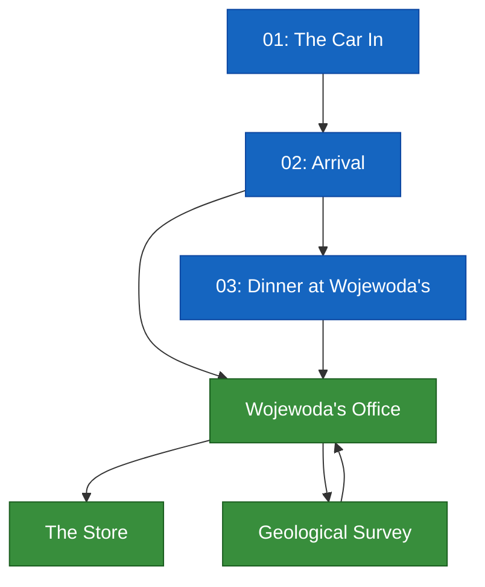

# Scenario Graph

> **Source of truth: `scenes/` folder.** Events are blue, locations are green.

## Overview Diagram

---

## Events (3)

| File | Event | Triggered by |
|------|-------|--------------|
| `events/01-the-car-in.md` | The Car In | Game start |
| `events/02-arrival.md` | Arrival | Exit from 01 |
| `events/03-dinner.md` | Dinner at Wojewoda's | First evening, if flood not discussed |

## Locations (3)

| File | Location | Available from |
|------|----------|----------------|
| `locations/wojewodas-office.md` | Wojewoda's Office | After arrival |
| `locations/the-store.md` | The Store | Daytime, any day |
| `locations/geological-survey.md` | Geological Survey | Any day, needs geologist |
