# Scenario Graph

## Overview Diagram

```mermaid
graph TD
    %% === START ===
    START[Car Scene: Officer Briefing] --> ARRIVE[Arrive in New Village]
    ARRIVE --> WOJEWODA_MEET[Meet Wojewoda]
    
    %% === CORE INVESTIGATION BRANCHES ===
    WOJEWODA_MEET --> CENSUS[Begin Census Work]
    WOJEWODA_MEET --> EXPLORE_VILLAGE[Explore New Village]
    WOJEWODA_MEET --> PHONE_ACCESS[Access Phone in Office]

    %% === CENSUS THREAD ===
    CENSUS --> CIOTKA_CENSUS[Census Ciotka + Glupek]
    CENSUS --> BARBARA_CENSUS[Census Barbara + Pawelek]
    CENSUS --> LEDGER[Inspect PGR Ledger]
    CENSUS --> FOREMAN_MEET[Meet Foreman]
    
    CIOTKA_CENSUS --> CIOTKA_LIES[Ciotka Lies About House/Father]
    CIOTKA_LIES -->|convince Glupek safe| CIOTKA_CRACKS[Ciotka Reveals Fragments]
    
    BARBARA_CENSUS --> BARBARA_REFUSES[Barbara Refuses to Name Father]
    BARBARA_CENSUS --> BARBARA_FLOOD_RAGE[Barbara Learns About Flood: Rage]
    
    LEDGER -->|accounting ability| EMBEZZLEMENT[Discover Embezzlement]
    EMBEZZLEMENT --> FOREMAN_PANICS[Foreman Runs to Wojewoda]
    FOREMAN_PANICS --> PARANOIA_CHAIN[Both Panic About Different Secrets]
    
    %% === VILLAGE EXPLORATION ===
    EXPLORE_VILLAGE --> HALINA_GOSSIP[Talk to Halina: Gossip]
    EXPLORE_VILLAGE --> DRINKING_CREW[Find Wujas Drinking Circle]
    EXPLORE_VILLAGE --> PRIEST_VISIT[Visit Priest]
    EXPLORE_VILLAGE --> PAINTER_STUDIO[Visit Painter]
    EXPLORE_VILLAGE --> NEIGHBOUR_VISIT[Visit Neighbour]
    EXPLORE_VILLAGE --> BUTCHER_EDGE[Notice Butcher at Village Edge]
    
    %% === WUJAS THREAD ===
    DRINKING_CREW --> WUJAS_DRUNK[Wujas Drinks: Fragments Leak]
    WUJAS_DRUNK --> WUJAS_FRAGMENTS[Hear: She Didnt Deserve It / Jagna / Dont Be Like Us]
    WUJAS_FRAGMENTS -->|humanity| WUJAS_CONFESSION[Wujas Confesses Lynch]
    WUJAS_FRAGMENTS -->|pressure| WUJAS_SUICIDE[Wujas Suicide]
    WUJAS_FRAGMENTS -->|ignored| WUJAS_SPIRAL[Wujas Volatile Spiral]
    
    %% === BIMBER RED HERRING ===
    DRINKING_CREW --> BIMBER_CLUE[Notice Forest Trips]
    BIMBER_CLUE --> BIMBER_STILL[Find Bimber Still in Forest]
    BIMBER_STILL --> BIMBER_DEAD_END[Red Herring: Just Moonshine]
    BIMBER_STILL -->|leverage| WUJAS_PRESSURE[Pressure Wujas With Bimber]
    
    %% === PRIEST THREAD ===
    PRIEST_VISIT -->|no faith shown| PRIEST_COLD[Priest: Cold, Unhelpful]
    PRIEST_VISIT -->|faith/commandments| PRIEST_WARM[Priest Opens Up]
    PRIEST_WARM --> PRIEST_HINTS[Priest: Careful Hints About Village]
    PRIEST_HINTS -->|deep trust| PRIEST_BREAKS[Priest Reveals What He Knows]
    PRIEST_BREAKS --> PRIEST_PERMISSION[Priest Gives Ritual Permission]
    
    %% === PAINTER THREAD ===
    PAINTER_STUDIO --> WELL_PAINTINGS[See Well in His Paintings]
    PAINTER_STUDIO -->|alone, no Matrona| PAINTER_SPEAKS[Painter Speaks: Jagna]
    PAINTER_SPEAKS --> PAINTER_HEARD_VOICE[Painter: Heard Matronas Voice That Night]
    PAINTER_SPEAKS --> JAGNA_CENSUS[Painter Wants Jagna in Census]
    
    %% === MATRONA THREAD ===
    EXPLORE_VILLAGE --> MATRONA_MEET[Meet Matrona: Perfect Hostess]
    MATRONA_MEET --> MATRONA_STORY[Matrona Tells Almost-True Story]
    PAINTER_HEARD_VOICE --> MATRONA_EXPOSED[Matrona Exposed as Architect]
    
    %% === NEIGHBOUR THREAD ===
    NEIGHBOUR_VISIT --> NEIGHBOUR_NERVOUS[Neighbour: Jumpy, Evasive]
    NEIGHBOUR_NERVOUS -->|guilt/alcohol/authority| NEIGHBOUR_CRACKS[Neighbour Reveals: Heard the Lynch]
    NEIGHBOUR_NERVOUS -->|well pressure + no outlet| NEIGHBOUR_SNAPS[Neighbour Snaps: Organises Mob]
    
    %% === OLD VILLAGE / WELL ===
    EXPLORE_VILLAGE --> OLD_VILLAGE[Travel to Old Village]
    OLD_VILLAGE --> WELL_FOUND[Find the Well]
    WELL_FOUND --> WELL_EVIDENCE[Evidence: Overflow, Bone, Smell]
    WELL_FOUND --> BUTCHER_REACTS[Butcher Notices: Trespassing]
    
    %% === HAG THREAD ===
    OLD_VILLAGE --> HAUNTING_CLUES[Find Candles, Offerings, Footprints]
    HAUNTING_CLUES --> HAG_FOUND[Find Hag in Forest Cabin]
    HAG_FOUND --> HAG_EXPLAINS[Hag Explains: Dead, Ritual, Well]
    HAG_FOUND --> HAG_EVACUATION[Tell Hag About Evacuation: She Shows Up]
    HAG_EXPLAINS --> RITUAL_FORM[Obtain Ritual Form from Cabin]
    
    %% === BUNKER / ENGINEERING ===
    FOREMAN_MEET --> FOREMAN_PLAN[Foreman Reveals Flood Diversion Plan]
    FOREMAN_PLAN --> BUNKER_EXPEDITION[Enter UPA Bunker]
    BUNKER_EXPEDITION --> EXPLOSIVES[Retrieve Explosives]
    EXPLOSIVES --> DETONATION[Support Detonation]
    DETONATION --> END_ENGINEERING[ENDING: Village Saved]
    
    %% === WIFE-JUNIOR INVESTIGATION ===
    EXPLORE_VILLAGE --> WIFE_CONTACT[Contact Wife]
    WIFE_CONTACT -->|show humanity| WIFE_TRUSTS[Wife Trusts Players]
    WIFE_TRUSTS --> WIFE_EVIDENCE[Wife Shares: Shirt, Button, Notes, Timeline]
    WIFE_TRUSTS --> JUNIOR_ALLY[Junior Revealed as Ally]
    JUNIOR_ALLY --> JUNIOR_OLD_VILLAGE[Junior Knows Old Village Paths]
    
    %% === PAWELEK ILLNESS ===
    WELL_FOUND --> PAWELEK_ILL[Event: Pawelek Falls Ill]
    PAWELEK_ILL --> PAWELEK_DELIRIUM[Fever Dreams: Water, Old Woman, Whispers]
    PAWELEK_ILL --> BARBARA_DESPERATE[Barbara Desperate]
    PAWELEK_ILL --> JUNIOR_MOMENT[Junior May Step Up for Pawelek]
    
    %% === BUTCHER ESCALATION ===
    BUTCHER_EDGE --> BUTCHER_SOCIALISE[Butcher Starts Socialising/Drinking]
    BUTCHER_SOCIALISE --> BUTCHER_HUNTS[Butcher Decides Players Know Too Much]
    BUTCHER_HUNTS --> BUTCHER_DANGER[Direct Threat to Players]
    HAG_FOUND --> BUTCHER_KILLS_HAG[Optional: Butcher Kills Hag]
    BUTCHER_KILLS_HAG --> CONTAINMENT_BREAKS[Well Containment Breaks]
    
    %% === GLUPEK DANGER ===
    CIOTKA_CRACKS --> GLUPEK_TRUTH[Glupek Learns the Truth]
    WUJAS_CONFESSION --> GLUPEK_TRUTH
    GLUPEK_TRUTH --> GLUPEK_KILLS_CIOTKA[Glupek Kills Ciotka]
    GLUPEK_KILLS_CIOTKA --> SILENCE_SHATTERS[Village Silence Shatters]
    
    %% === PHONE CALLS ===
    PHONE_ACCESS --> CALL_PROFESSOR[Call Professor]
    PHONE_ACCESS --> CALL_DOCTOR[Call Doctor for Pawelek]
    PHONE_ACCESS --> CALL_AUTHORITIES[Call District Authorities]
    CALL_PROFESSOR --> PROFESSOR_KNOWS[Professor Has the Information]
    
    %% === RITUAL ENDING CHAIN ===
    RITUAL_FORM --> RITUAL_READY_FORM[Have: Ritual Form]
    PRIEST_PERMISSION --> BARBARA_FREED[Barbara Will Bring Babcia]
    BARBARA_FREED --> BABCIA_AT_WELL[Babcia at the Well: The Words]
    RITUAL_READY_FORM --> RITUAL_ATTEMPT[Attempt Ritual]
    BABCIA_AT_WELL --> RITUAL_ATTEMPT
    RITUAL_ATTEMPT --> END_RITUAL[ENDING: Dead Acknowledged, Well Quiets]
    
    %% === JUSTICE / LYNCH PREVENTION ===
    WUJAS_CONFESSION --> TRUTH_DOCUMENTED[Document Lynch Truth]
    NEIGHBOUR_CRACKS --> TRUTH_DOCUMENTED
    CIOTKA_CRACKS --> TRUTH_DOCUMENTED
    PAINTER_HEARD_VOICE --> TRUTH_DOCUMENTED
    TRUTH_DOCUMENTED --> CALL_AUTHORITIES
    CALL_AUTHORITIES --> JUSTICE_COMING[Legal Justice in Motion]
    JUSTICE_COMING --> NEIGHBOUR_STABLE[Neighbour Stabilised: No Mob]
    NEIGHBOUR_STABLE --> END_JUSTICE[ENDING: Lynch Prevented, Legal Justice]
    
    %% === PUNISHMENT ENDING ===
    NEIGHBOUR_SNAPS --> MOB_FORMS[Mob Forms]
    MOB_FORMS --> END_PUNISHMENT[ENDING: Second Lynch]
    
    %% === REPORT ENDING ===
    WELL_EVIDENCE --> MASSACRE_DISCOVERED[Discover 1947 Massacre Evidence]
    HAG_EXPLAINS --> MASSACRE_DISCOVERED
    MASSACRE_DISCOVERED --> REPORT_CHOICE{Include Massacre in Report?}
    REPORT_CHOICE -->|omit| END_QUIET[ENDING: Quiet Departure, Truth Buried]
    REPORT_CHOICE -->|include + no call| END_GUN[ENDING: Officer Reaches for Gun]
    REPORT_CHOICE -->|include + Professor called| END_SURVIVE[ENDING: Gun Stays, Truth Lives]
    
    %% === STYLING ===
    classDef ending fill:#d32f2f,color:#fff,stroke:#b71c1c
    classDef goodending fill:#388e3c,color:#fff,stroke:#1b5e20
    classDef redhering fill:#f57c00,color:#fff,stroke:#e65100
    classDef gate fill:#1565c0,color:#fff,stroke:#0d47a1
    classDef event fill:#7b1fa2,color:#fff,stroke:#4a148c
    
    class END_RITUAL,END_ENGINEERING,END_JUSTICE,END_SURVIVE goodending
    class END_PUNISHMENT,END_GUN ending
    class END_QUIET ending
    class BIMBER_DEAD_END,EMBEZZLEMENT,PARANOIA_CHAIN redhering
    class PRIEST_PERMISSION,BARBARA_FREED,REPORT_CHOICE gate
    class PAWELEK_ILL,BUTCHER_KILLS_HAG,GLUPEK_KILLS_CIOTKA,NEIGHBOUR_SNAPS,SILENCE_SHATTERS event
```

---

## Detailed Node Descriptions

### START NODES

#### `START` — Car Scene: Officer Briefing
- **Type:** Opening scene
- **Unlocked by:** Game begins
- **Description:** %OFFICER% drives the players to %NEW_VILLAGE%. He debriefs them: census work, flood assessment, %WOJEWODA% is the contact. Buries one line: *"Not everything needs to be written down."*
- **Unlocks:** `ARRIVE`

#### `ARRIVE` — Arrive in New Village
- **Type:** Scene transition
- **Unlocked by:** `START`
- **Description:** Players enter %NEW_VILLAGE%. Road is still open (Day 1). By Day 2 it washes out.
- **Unlocks:** `WOJEWODA_MEET`

#### `WOJEWODA_MEET` — Meet Wojewoda
- **Type:** NPC interaction
- **Unlocked by:** `ARRIVE`
- **Description:** %WOJEWODA% greets the committee. Cooperative, helpful, genuine leader. Advises: keep flood news quiet, census everyone, cooperate on evacuation. Gives access to his office and phone.
- **Unlocks:** `CENSUS`, `EXPLORE_VILLAGE`, `PHONE_ACCESS`

---

### CENSUS THREAD

#### `CENSUS` — Begin Census Work
- **Type:** Action
- **Unlocked by:** `WOJEWODA_MEET`
- **Description:** Players start documenting the village. Names, property, families. The cover story and legitimate job.
- **Unlocks:** `CIOTKA_CENSUS`, `BARBARA_CENSUS`, `LEDGER`, `FOREMAN_MEET`

#### `CIOTKA_CENSUS` — Census Ciotka + Glupek
- **Type:** NPC interaction
- **Unlocked by:** `CENSUS`
- **Description:** The census asks: whose house? Who is Glupek's father? Every question leads to the lynch.
- **Unlocks:** `CIOTKA_LIES`

#### `CIOTKA_LIES` — Ciotka Lies About House/Father
- **Type:** NPC state
- **Unlocked by:** `CIOTKA_CENSUS`
- **Description:** %CIOTKA% gives practiced, quiet lies. Consistent but visibly terrified. She won't break unless %GLUPEK%'s safety is guaranteed.
- **Unlocks:** `CIOTKA_CRACKS` (requires: convince her Glupek won't be harmed)

#### `CIOTKA_CRACKS` — Ciotka Reveals Fragments
- **Type:** Information
- **Unlocked by:** `CIOTKA_LIES` + player convinces her %GLUPEK% is safe
- **Description:** Partial truth about the lynch. She saved %GLUPEK%. She knows who did it. She's been confessing to %PRIEST% for 13 years.
- **Unlocks:** `TRUTH_DOCUMENTED`, `GLUPEK_TRUTH` (risk)

#### `BARBARA_CENSUS` — Census Barbara + Pawelek
- **Type:** NPC interaction
- **Unlocked by:** `CENSUS`
- **Description:** %BARBARA% cooperates on everything except %PAWEŁEK%'s father. That line is immovable.
- **Unlocks:** `BARBARA_REFUSES`, `BARBARA_FLOOD_RAGE`

#### `BARBARA_REFUSES` — Barbara Refuses to Name Father
- **Type:** NPC state (locked)
- **Unlocked by:** `BARBARA_CENSUS`
- **Description:** She will not name the father. Not for the government, not for anyone.
- **Note:** This is a dead end unless %PAWEŁEK%'s illness forces her hand.

#### `BARBARA_FLOOD_RAGE` — Barbara Learns About Flood
- **Type:** NPC state change
- **Unlocked by:** `BARBARA_CENSUS` + player reveals flood truth
- **Description:** Panic, then rage. Her house — built new by %WOJEWODA% — is going underwater. Single mother, no money, nowhere to go. Anger at the government, not at secrets.

#### `LEDGER` — Inspect PGR Ledger
- **Type:** Action
- **Unlocked by:** `CENSUS`
- **Description:** Players examine farm records as part of damage assessment.
- **Unlocks:** `EMBEZZLEMENT` (requires: accounting ability or careful inspection)

#### `EMBEZZLEMENT` — Discover Foreman's Embezzlement
- **Type:** Information (RED HERRING)
- **Unlocked by:** `LEDGER` + ability
- **Description:** Phantom workers, skimmed supplies, padded expenses. Looks suspicious — is it funding a cover-up? No. It's just PGR corruption.
- **Unlocks:** `FOREMAN_PANICS`

#### `FOREMAN_PANICS` — Foreman Runs to Wojewoda
- **Type:** Event (RED HERRING)
- **Unlocked by:** `EMBEZZLEMENT` + player presses %FOREMAN%
- **Description:** %FOREMAN% warns %WOJEWODA% the committee is "poking around the books." %WOJEWODA% panics about the lynch. Two men terrified about two different secrets. Comedy of errors that makes both look guilty.
- **Unlocks:** `PARANOIA_CHAIN`

#### `FOREMAN_MEET` — Meet Foreman
- **Type:** NPC interaction
- **Unlocked by:** `CENSUS` or `EXPLORE_VILLAGE`
- **Description:** %FOREMAN% manages the farm and the anti-flood measures. Competent, stubborn, fighting the water with sandbags and willpower.
- **Unlocks:** `FOREMAN_PLAN`

#### `FOREMAN_PLAN` — Foreman Reveals Flood Diversion Plan
- **Type:** Information
- **Unlocked by:** `FOREMAN_MEET` + time/trust
- **Description:** He has a plan: blow a rock formation with explosives to redirect floodwater. Insane, dangerous, might work. Needs explosives from the UPA bunker.
- **Unlocks:** `BUNKER_EXPEDITION`

---

### VILLAGE EXPLORATION THREAD

#### `EXPLORE_VILLAGE` — Explore New Village
- **Type:** Action
- **Unlocked by:** `WOJEWODA_MEET`
- **Description:** Players walk the village, meet people, observe.
- **Unlocks:** `HALINA_GOSSIP`, `DRINKING_CREW`, `PRIEST_VISIT`, `PAINTER_STUDIO`, `NEIGHBOUR_VISIT`, `BUTCHER_EDGE`, `MATRONA_MEET`, `OLD_VILLAGE`, `WIFE_CONTACT`

#### `HALINA_GOSSIP` — Talk to Halina at the Store
- **Type:** Information (gossip)
- **Unlocked by:** `EXPLORE_VILLAGE`
- **Description:** Village gossip. Rumours, hints, colour. She's noticed %FOREMAN% trading farm goods. She knows who talks to whom.
- **Unlocks:** Various soft leads

#### `MATRONA_MEET` — Meet Matrona
- **Type:** NPC interaction
- **Unlocked by:** `EXPLORE_VILLAGE`
- **Description:** Perfect hostess. Warm, helpful, cooperative. Follows %WOJEWODA%'s lead.
- **Unlocks:** `MATRONA_STORY`

#### `MATRONA_STORY` — Matrona Tells Almost-True Story
- **Type:** Information (MISLEADING)
- **Unlocked by:** `MATRONA_MEET`
- **Description:** She gives the players a version of events that's almost true, with herself edited out. The hardest NPC to crack.
- **Note:** Only exposed through `PAINTER_HEARD_VOICE`, `BUTCHER` memory, or `CIOTKA`

---

### WUJAS / DRINKING THREAD

#### `DRINKING_CREW` — Find Wujas Drinking Circle
- **Type:** NPC interaction
- **Unlocked by:** `EXPLORE_VILLAGE`
- **Description:** %WUJAS%, %SZYMEK%, %ROMEK%, %FRANEK%. Drunk, rough, loose-tongued.
- **Unlocks:** `WUJAS_DRUNK`, `BIMBER_CLUE`

#### `WUJAS_DRUNK` — Wujas Drinks, Fragments Leak
- **Type:** NPC state
- **Unlocked by:** `DRINKING_CREW`
- **Description:** Drunk enough to let things slip. *"She didn't deserve it." The name Jagna. "Don't ever be like us."*
- **Unlocks:** `WUJAS_FRAGMENTS`

#### `WUJAS_FRAGMENTS` — Hear Lynch Fragments
- **Type:** Information (partial)
- **Unlocked by:** `WUJAS_DRUNK`
- **Description:** Pieces of the lynch story — names, guilt, fragments of the night. Not the full picture.
- **Unlocks:** `WUJAS_CONFESSION` (humanity path), `WUJAS_SUICIDE` (pressure path), `WUJAS_SPIRAL` (ignored)

#### `WUJAS_CONFESSION` — Wujas Confesses the Lynch
- **Type:** Information (MAJOR)
- **Unlocked by:** `WUJAS_FRAGMENTS` + player shows humanity
- **Description:** The clearest, most direct account of the lynch. Who did what. %MATRONA% gave the order. The bodies went in the well.
- **Unlocks:** `TRUTH_DOCUMENTED`, `GLUPEK_TRUTH` (risk)

#### `WUJAS_SUICIDE` — Wujas Kills Himself
- **Type:** Event
- **Unlocked by:** `WUJAS_FRAGMENTS` + player uses pressure/intimidation
- **Description:** He breaks, but not into confession. Into self-destruction. A witness lost forever.

#### `WUJAS_SPIRAL` — Wujas Volatile Spiral
- **Type:** NPC state (dangerous)
- **Unlocked by:** `WUJAS_FRAGMENTS` + ignored/overloaded
- **Description:** Public leakage, erratic behaviour, dangerous for everyone. May trigger other NPCs.

#### `BIMBER_CLUE` — Notice Forest Trips
- **Type:** Information
- **Unlocked by:** `DRINKING_CREW`
- **Description:** The drinking crew makes suspicious trips to the forest. Something hidden out there.
- **Unlocks:** `BIMBER_STILL`

#### `BIMBER_STILL` — Find Bimber Still in Forest
- **Type:** Information (RED HERRING)
- **Unlocked by:** `BIMBER_CLUE` + follow them / search forest
- **Description:** Illegal moonshine operation. Looks like a conspiracy. It's just booze.
- **Unlocks:** `BIMBER_DEAD_END`, `WUJAS_PRESSURE` (leverage)

---

### PRIEST THREAD

#### `PRIEST_VISIT` — Visit Priest
- **Type:** NPC interaction
- **Unlocked by:** `EXPLORE_VILLAGE`
- **Description:** %PRIEST% is cold by default. Polite, unhelpful. Government people.
- **Unlocks:** `PRIEST_COLD` (no faith shown) or `PRIEST_WARM` (faith/respect shown)

#### `PRIEST_COLD` — Priest: Cold, Unhelpful
- **Type:** NPC state (locked)
- **Unlocked by:** `PRIEST_VISIT` + no faith demonstrated
- **Description:** One-word answers. Doesn't invite them in. Dead end unless players return with a different approach.

#### `PRIEST_WARM` — Priest Opens Up
- **Type:** NPC state change
- **Unlocked by:** `PRIEST_VISIT` + faith ability / commandments respect / genuine belief
- **Description:** Tea. Conversation. He tests them. Shares observations — carefully, selectively.
- **Unlocks:** `PRIEST_HINTS`

#### `PRIEST_HINTS` — Priest Gives Careful Hints
- **Type:** Information (partial)
- **Unlocked by:** `PRIEST_WARM`
- **Description:** Allusions to the village's past. Nothing direct. Enough to point players toward the right questions.
- **Unlocks:** `PRIEST_BREAKS` (requires deep trust + moral argument)

#### `PRIEST_BREAKS` — Priest Reveals What He Knows
- **Type:** Information (MAJOR)
- **Unlocked by:** `PRIEST_HINTS` + player makes a moral case that breaks his silence justification
- **Description:** The full picture from 13 years of confessions. The lynch, the roles, %MATRONA% as architect. He knows almost everything.
- **Unlocks:** `PRIEST_PERMISSION`

#### `PRIEST_PERMISSION` — Priest Gives Ritual Permission
- **Type:** Gate (CRITICAL)
- **Unlocked by:** `PRIEST_BREAKS` + player asks for the ritual blessing
- **Description:** He agrees to let %BARBARA% bring %BABCIA% to the well for the Lemko rite. The theological ceiling cracks. He admits his prayers aren't enough.
- **Unlocks:** `BARBARA_FREED`

---

### PAINTER THREAD

#### `PAINTER_STUDIO` — Visit Painter
- **Type:** NPC interaction
- **Unlocked by:** `EXPLORE_VILLAGE`
- **Description:** %PAINTER% at work. If %MATRONA% is present, he says nothing interesting.
- **Unlocks:** `WELL_PAINTINGS`, `PAINTER_SPEAKS` (requires: alone, no Matrona)

#### `WELL_PAINTINGS` — See Well in His Paintings
- **Type:** Information (clue)
- **Unlocked by:** `PAINTER_STUDIO`
- **Description:** Dark circles, stone rings, black water — the well appears in his art uninvited. A visual clue before players find the actual well.

#### `PAINTER_SPEAKS` — Painter Speaks About Jagna
- **Type:** Information (MAJOR)
- **Unlocked by:** `PAINTER_STUDIO` + alone, away from %MATRONA%
- **Description:** He loved %JAGNA%. He was beaten and chased off. He heard %MATRONA%'s voice giving orders as he ran.
- **Unlocks:** `PAINTER_HEARD_VOICE`, `JAGNA_CENSUS`

#### `PAINTER_HEARD_VOICE` — Painter: Heard Matrona's Voice
- **Type:** Information (CRITICAL — exposes Matrona)
- **Unlocked by:** `PAINTER_SPEAKS`
- **Description:** The evidence that %MATRONA% orchestrated the lynch. She was sober. She gave instructions.
- **Unlocks:** `MATRONA_EXPOSED`, `TRUTH_DOCUMENTED`

#### `JAGNA_CENSUS` — Painter Wants Jagna in Census
- **Type:** NPC desire
- **Unlocked by:** `PAINTER_SPEAKS`
- **Description:** He wants a dead woman's name on government paper. So something survives the water. Player choice whether to honour this.

---

### NEIGHBOUR THREAD

#### `NEIGHBOUR_VISIT` — Visit Neighbour
- **Type:** NPC interaction
- **Unlocked by:** `EXPLORE_VILLAGE`
- **Description:** Jumpy, evasive, paranoid. Lives next to %CIOTKA% and %GLUPEK%. Flinches from strangers.
- **Unlocks:** `NEIGHBOUR_NERVOUS`

#### `NEIGHBOUR_NERVOUS` — Neighbour: Jumpy, Evasive
- **Type:** NPC state
- **Unlocked by:** `NEIGHBOUR_VISIT`
- **Description:** The easiest NPC to crack — but also the most dangerous when cracked. Guilt of inaction, not action.
- **Unlocks:** `NEIGHBOUR_CRACKS` (guilt/alcohol/authority) or `NEIGHBOUR_SNAPS` (well pressure + no outlet)

#### `NEIGHBOUR_CRACKS` — Neighbour Reveals: Heard the Lynch
- **Type:** Information (MAJOR)
- **Unlocked by:** `NEIGHBOUR_NERVOUS` + player applies guilt/alcohol/authority
- **Description:** Partial knowledge — sounds, shapes, direction. Enough to point toward %OLD_VILLAGE% and the well. Can't name names outright but can confirm it happened.
- **Unlocks:** `TRUTH_DOCUMENTED`

#### `NEIGHBOUR_SNAPS` — Neighbour Snaps: Organises Mob
- **Type:** Event (CRITICAL — punishment ending trigger)
- **Unlocked by:** `NEIGHBOUR_NERVOUS` + well pressure + truth exposed without structure
- **Description:** Overcorrection. He will *act* this time. Grabs men from the drinking circle. Drunk, dark, no road out.
- **Unlocks:** `MOB_FORMS`

---

### OLD VILLAGE / WELL / HAG

#### `OLD_VILLAGE` — Travel to Old Village
- **Type:** Action
- **Unlocked by:** `EXPLORE_VILLAGE`
- **Description:** Ruins, overgrown paths, the remnants of the Lemko village.
- **Unlocks:** `WELL_FOUND`, `HAUNTING_CLUES`

#### `WELL_FOUND` — Find the Well
- **Type:** Information (CRITICAL)
- **Unlocked by:** `OLD_VILLAGE`
- **Description:** The well. Stone walls, dark water, the smell. Evidence of overflow — bone fragments, disturbed earth.
- **Unlocks:** `WELL_EVIDENCE`, `BUTCHER_REACTS`, `PAWELEK_ILL` (time trigger)

#### `WELL_EVIDENCE` — Evidence at the Well
- **Type:** Information
- **Unlocked by:** `WELL_FOUND`
- **Description:** Physical evidence — overflow, bones, smell. Proof something is in the water.
- **Unlocks:** `MASSACRE_DISCOVERED` (if combined with other sources)

#### `HAUNTING_CLUES` — Find Candles, Offerings, Footprints
- **Type:** Information
- **Unlocked by:** `OLD_VILLAGE`
- **Description:** Signs someone has been tending the ruins. Candle wax, incense, small offerings. The "ghost" of %OLD_VILLAGE%.
- **Unlocks:** `HAG_FOUND`

#### `HAG_FOUND` — Find Hag in Forest Cabin
- **Type:** NPC interaction (CRITICAL)
- **Unlocked by:** `HAUNTING_CLUES` + follow the trail
- **Description:** A Lemko woman living alone in the forest for 20 years. She's been containing the well through rites.
- **Unlocks:** `HAG_EXPLAINS`, `HAG_EVACUATION`, `BUTCHER_KILLS_HAG` (risk — if Butcher escalates)

#### `HAG_EXPLAINS` — Hag Explains: Dead, Ritual, Well
- **Type:** Information (MAJOR)
- **Unlocked by:** `HAG_FOUND`
- **Description:** The massacre, the dead, why the well is angry, what the ritual does. Living witness + ritual teacher.
- **Unlocks:** `RITUAL_FORM`, `MASSACRE_DISCOVERED`

#### `HAG_EVACUATION` — Tell Hag About Evacuation
- **Type:** NPC state change
- **Unlocked by:** `HAG_FOUND` + player explains evacuation + writes her in census
- **Description:** She wants to live. Tell her where and when to show up. She'll be there.

#### `RITUAL_FORM` — Obtain Ritual Form from Cabin
- **Type:** Item/Knowledge
- **Unlocked by:** `HAG_EXPLAINS` (Hag alive teaches directly) or `HAG_FOUND` + cabin investigation (Hag dead — reconstruct from icons, candles, diagram)
- **Description:** The form of the ritual — the physical arrangement, the sacred geometry, the offerings.
- **Unlocks:** `RITUAL_READY_FORM`

---

### BUNKER / ENGINEERING ENDING

#### `BUNKER_EXPEDITION` — Enter UPA Bunker
- **Type:** Action (DANGEROUS)
- **Unlocked by:** `FOREMAN_PLAN`
- **Description:** Collapsed tunnels, flooded sections, rotting timber. Old partisan ordnance inside — unstable, possibly live.
- **Unlocks:** `EXPLOSIVES`

#### `EXPLOSIVES` — Retrieve Explosives
- **Type:** Item
- **Unlocked by:** `BUNKER_EXPEDITION` + survive
- **Description:** Old UPA munitions. Decades old, degraded. Enough to blow a rock formation.
- **Unlocks:** `DETONATION`

#### `DETONATION` — Support Detonation
- **Type:** Action
- **Unlocked by:** `EXPLOSIVES` + %FOREMAN%'s plan + player support
- **Description:** Place charges, clear area, blow the rock. %FOREMAN% on inhuman fortitude does the rest.
- **Unlocks:** `END_ENGINEERING`

---

### WIFE-JUNIOR INVESTIGATION

#### `WIFE_CONTACT` — Contact Wife
- **Type:** NPC interaction
- **Unlocked by:** `EXPLORE_VILLAGE`
- **Description:** %WIFE% is cautious. She backs her husband publicly but watches the players carefully.
- **Unlocks:** `WIFE_TRUSTS` (requires: show genuine humanity, not state authority)

#### `WIFE_TRUSTS` — Wife Trusts Players
- **Type:** NPC state change
- **Unlocked by:** `WIFE_CONTACT` + humanity demonstrated
- **Description:** She reveals her 13-year investigation. Flour tin of evidence. Her son %JUNIOR% has been helping.
- **Unlocks:** `WIFE_EVIDENCE`, `JUNIOR_ALLY`

#### `WIFE_EVIDENCE` — Wife Shares Evidence
- **Type:** Information
- **Unlocked by:** `WIFE_TRUSTS`
- **Description:** Stained shirt, button, newspaper clippings, notes, drunken fragments, rough timeline. Partial but real.

#### `JUNIOR_ALLY` — Junior Revealed as Ally
- **Type:** NPC state change
- **Unlocked by:** `WIFE_TRUSTS`
- **Description:** The false suspect is actually an investigator. He knows %OLD_VILLAGE% paths. He has %WUJAS%'s fragments.
- **Unlocks:** `JUNIOR_OLD_VILLAGE`

---

### PAWELEK ILLNESS

#### `PAWELEK_ILL` — Pawelek Falls Ill
- **Type:** Event (time trigger)
- **Unlocked by:** Well strengthens (Day 3-4 area)
- **Description:** %PAWEŁEK% wanders to the well, drinks contaminated floodwater, falls violently ill. Fever dreams with fragments he shouldn't know.
- **Unlocks:** `PAWELEK_DELIRIUM`, `BARBARA_DESPERATE`, `JUNIOR_MOMENT`

#### `PAWELEK_DELIRIUM` — Fever Dreams
- **Type:** Information (clue)
- **Unlocked by:** `PAWELEK_ILL`
- **Description:** "The water under the ground." "The old woman." Whispers near the well. Medical explanation is airtight. The content is unsettling.

#### `BARBARA_DESPERATE` — Barbara Desperate
- **Type:** NPC state change
- **Unlocked by:** `PAWELEK_ILL`
- **Description:** Her child is dying. She becomes vulnerable, willing to talk, willing to accept help from anyone.

#### `JUNIOR_MOMENT` — Junior May Step Up
- **Type:** NPC state change (optional)
- **Unlocked by:** `PAWELEK_ILL`
- **Description:** The boy he's been avoiding is sick. This is where the avoidance can end. If he chooses to act, he starts being a father.

---

### BUTCHER ESCALATION

#### `BUTCHER_EDGE` — Notice Butcher at Village Edge
- **Type:** Information (atmosphere)
- **Unlocked by:** `EXPLORE_VILLAGE`
- **Description:** Man with dogs at the edge of the village. People avoid him. Dogs whine.

#### `BUTCHER_SOCIALISE` — Butcher Starts Socialising/Drinking
- **Type:** NPC state change (time trigger)
- **Unlocked by:** Well strengthens (Day 3+)
- **Description:** The man who avoided everyone for 13 years starts showing up. Accepts a bottle. Makes small talk. Dogs won't follow him. The village's canary in the coal mine.

#### `BUTCHER_HUNTS` — Butcher Decides Players Know Too Much
- **Type:** Event (conditional)
- **Unlocked by:** Players ask about %SOLDIER%, visit well, talk to %WUJAS% drunk, confront directly
- **Description:** Escalation: observation → intimidation → direct action. Silent hunter.
- **Unlocks:** `BUTCHER_DANGER`

#### `BUTCHER_KILLS_HAG` — Optional: Butcher Kills Hag
- **Type:** Event (OPTIONAL)
- **Unlocked by:** Both %BUTCHER% escalation and %HAG% appearing coincide without player intervention
- **Description:** He finds her at the well. Kills her. Throws her in. Another body in the water.
- **Unlocks:** `CONTAINMENT_BREAKS`

#### `CONTAINMENT_BREAKS` — Well Containment Breaks
- **Type:** World state change
- **Unlocked by:** `BUTCHER_KILLS_HAG`
- **Description:** Everyone's dreams explode. Village deteriorates faster. The ritual becomes harder (must reconstruct without %HAG%).

---

### GLUPEK DANGER

#### `GLUPEK_TRUTH` — Glupek Learns the Truth
- **Type:** Event (DANGEROUS)
- **Unlocked by:** Player tells him, overhears confrontation, %WUJAS% slips while drunk, or well crisis exposes it
- **Description:** He learns what happened to his parents. Who did it. Who he's been living with.
- **Unlocks:** `GLUPEK_KILLS_CIOTKA`

#### `GLUPEK_KILLS_CIOTKA` — Glupek Kills Ciotka
- **Type:** Event (CATASTROPHIC)
- **Unlocked by:** `GLUPEK_TRUTH`
- **Description:** He strangles the woman who saved him. Hides in the church. %PRIEST% shelters him.
- **Unlocks:** `SILENCE_SHATTERS`

#### `SILENCE_SHATTERS` — Village Silence Shatters
- **Type:** World state change
- **Unlocked by:** `GLUPEK_KILLS_CIOTKA`
- **Description:** The cover-up collapses. %WOJEWODA% loses control. %BUTCHER% sees unfinished business. Everything accelerates.

---

### PHONE CALLS

#### `PHONE_ACCESS` — Access Phone in Wojewoda's Office
- **Type:** Action
- **Unlocked by:** `WOJEWODA_MEET` (he grants access) or sneak in
- **Description:** The only phone in the village. Heavy bakelite handset. %WOJEWODA% decides who uses it — or the players find a way.
- **Unlocks:** `CALL_PROFESSOR`, `CALL_DOCTOR`, `CALL_AUTHORITIES`

#### `CALL_PROFESSOR` — Call Professor
- **Type:** Action (CRITICAL — hidden safeguard)
- **Unlocked by:** `PHONE_ACCESS`
- **Description:** Players call %PROFESSOR% for any reason — hydrology data, technical questions, or to tell him what they found. If they mention the massacre, the truth exists outside the village.
- **Unlocks:** `PROFESSOR_KNOWS`

#### `PROFESSOR_KNOWS` — Professor Has the Information
- **Type:** World state (HIDDEN)
- **Unlocked by:** `CALL_PROFESSOR` + massacre mentioned
- **Description:** The insurance policy. %OFFICER% can't erase the truth by erasing the players. This node determines whether they survive the final car scene.

#### `CALL_DOCTOR` — Call Doctor for Pawelek
- **Type:** Action
- **Unlocked by:** `PHONE_ACCESS` + `PAWELEK_ILL`
- **Description:** Medical advice over the phone. Clean water, rest, hydration. May save %PAWEŁEK%'s life.

#### `CALL_AUTHORITIES` — Call District Authorities
- **Type:** Action
- **Unlocked by:** `PHONE_ACCESS` + `TRUTH_DOCUMENTED`
- **Description:** The truth leaves the village through the wire. Legal justice in motion. %OFFICER% may not know this happened.
- **Unlocks:** `JUSTICE_COMING`

---

### RITUAL ENDING CHAIN

#### `RITUAL_READY_FORM` — Have Ritual Form
- **Type:** Gate
- **Unlocked by:** `RITUAL_FORM`
- **Description:** Players possess the knowledge/arrangement for the rite.

#### `BARBARA_FREED` — Barbara Will Bring Babcia
- **Type:** Gate (CRITICAL)
- **Unlocked by:** `PRIEST_PERMISSION`
- **Description:** %PRIEST% has given his blessing. %BARBARA% will now bring %BABCIA% to the well.

#### `BABCIA_AT_WELL` — Babcia at the Well: The Words
- **Type:** Event
- **Unlocked by:** `BARBARA_FREED`
- **Description:** %BABCIA% speaks the panakhyda. The old Lemko prayer, remembered with well-sharpened clarity.

#### `RITUAL_ATTEMPT` — Attempt Ritual
- **Type:** Action
- **Unlocked by:** `RITUAL_READY_FORM` + `BABCIA_AT_WELL` + players acknowledge the truth
- **Description:** Form + words + truth. Players stand at the well and name the dead.

#### `END_RITUAL` — ENDING: Dead Acknowledged, Well Quiets
- **Type:** Terminal (GOOD)
- **Unlocked by:** `RITUAL_ATTEMPT`
- **Description:** The well quiets. The dead are named. The spiritual wound begins to close.

---

### JUSTICE / LYNCH PREVENTION

#### `TRUTH_DOCUMENTED` — Document Lynch Truth
- **Type:** Information (assembled)
- **Unlocked by:** Any combination of: `WUJAS_CONFESSION`, `NEIGHBOUR_CRACKS`, `CIOTKA_CRACKS`, `PAINTER_HEARD_VOICE`
- **Description:** Enough testimony and evidence to build an official account of the 1954 lynch.

#### `JUSTICE_COMING` — Legal Justice in Motion
- **Type:** World state
- **Unlocked by:** `CALL_AUTHORITIES`
- **Description:** The district knows. Something is happening. The village feels it — tension shifts.
- **Unlocks:** `NEIGHBOUR_STABLE`

#### `NEIGHBOUR_STABLE` — Neighbour Stabilised
- **Type:** NPC state
- **Unlocked by:** `JUSTICE_COMING` + player keeps %NEIGHBOUR% on confession path
- **Description:** He doesn't need to lynch anyone. Justice is coming through the wire. The overcorrection is redirected.
- **Unlocks:** `END_JUSTICE`

#### `END_JUSTICE` — ENDING: Lynch Prevented, Legal Justice
- **Type:** Terminal (GOOD)
- **Unlocked by:** `NEIGHBOUR_STABLE`
- **Description:** The cycle breaks. No new bodies in the well. %WOJEWODA% takes responsibility. %MATRONA% is exposed. The law handles it.

---

### PUNISHMENT ENDING

#### `MOB_FORMS` — Mob Forms
- **Type:** Event
- **Unlocked by:** `NEIGHBOUR_SNAPS`
- **Description:** Drunk men, darkness, no road out. Same mechanics as 1954. Any NPC or player can be the target.

#### `END_PUNISHMENT` — ENDING: Second Lynch
- **Type:** Terminal (BAD)
- **Unlocked by:** `MOB_FORMS`
- **Description:** The well gets more dead. The cycle repeats. The village that was built on a massacre commits another one.

---

### ENGINEERING ENDING

#### `END_ENGINEERING` — ENDING: Village Saved
- **Type:** Terminal (GOOD)
- **Unlocked by:** `DETONATION`
- **Description:** The water turns. The village stands. %FOREMAN% sits down. The man who fought the water won.

---

### REPORT ENDING

#### `MASSACRE_DISCOVERED` — Discover 1947 Massacre Evidence
- **Type:** Information (CRITICAL)
- **Unlocked by:** `WELL_EVIDENCE` + other sources, or `HAG_EXPLAINS`
- **Description:** Players learn about the Lemko massacre and the state's role in burying it.

#### `REPORT_CHOICE` — Include Massacre in Report?
- **Type:** Player choice (final scene)
- **Unlocked by:** `MASSACRE_DISCOVERED` + game ends
- **Description:** The car. %OFFICER% reads. What did you write?

#### `END_QUIET` — ENDING: Quiet Departure
- **Type:** Terminal (GREY)
- **Unlocked by:** `REPORT_CHOICE` — massacre omitted
- **Description:** The car drives away. The players are safe. And they know what they chose not to write.

#### `END_GUN` — ENDING: Officer Reaches for Gun
- **Type:** Terminal (BAD)
- **Unlocked by:** `REPORT_CHOICE` — massacre included + `PROFESSOR_KNOWS` is NOT unlocked
- **Description:** The gun. THE END.

#### `END_SURVIVE` — ENDING: Gun Stays, Truth Lives
- **Type:** Terminal (GOOD)
- **Unlocked by:** `REPORT_CHOICE` — massacre included + `PROFESSOR_KNOWS` IS unlocked
- **Description:** %OFFICER% reaches for the gun — and stops. The truth is already out. The players live.
