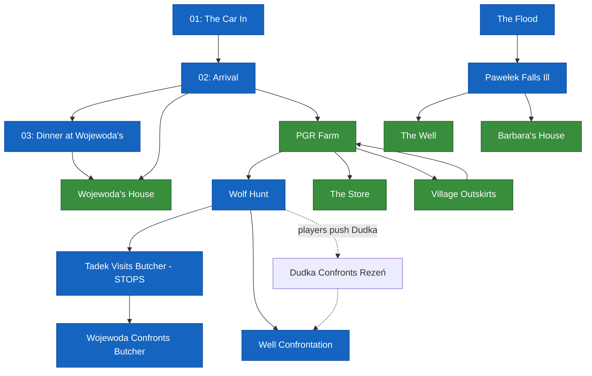

# Scenario Graph

> **Source of truth: `scenes/` folder.** Events are blue, locations are green.

## Overview Diagram

---

## Events (3)

| File | Event | Triggered by |
|------|-------|--------------|
| `events/01-the-car-in.md` | The Car In | Game start |
| `events/02-arrival.md` | Arrival | Exit from 01 |
| `events/03-dinner.md` | Dinner at Wojewoda's | First evening, if flood not discussed |
| `events/event-wujas-visits-butcher.md` | Tadek Visits the Butcher | Recurring, early game. Stops Day 1-2 (wolf errand) |
| `events/event-wolf-hunt.md` | The Wolf Hunt | Day 1-2. Zbigniew authorizes Rezeń after assessing wolf damage |
| `events/event-well-confrontation.md` | The Well Confrontation | Night of Day 4. Rezeń loose + hag at well + village hostile (wolf rumor) |
| `events/event-pawelek-falls-ill.md` | Pawełek Falls Ill | Day 3+. After flood. Pawełek drinks contaminated water near the old village well |

## Locations (3)

| File | Location | Available from |
|------|----------|----------------|
| `locations/wojewodas-house.md` | Wojewoda's House | After arrival |
| `locations/pgr-office.md` | PGR Office | After arrival |
| `locations/pgr-farm.md` | PGR Farm | Daytime, any day |
| `locations/pgr-quarters.md` | PGR Workers' Quarters | Any time |
| `locations/the-store.md` | The Store | Daytime, any day |
| `locations/village-outskirts.md` | Village Outskirts | Any day, needs geologist |
